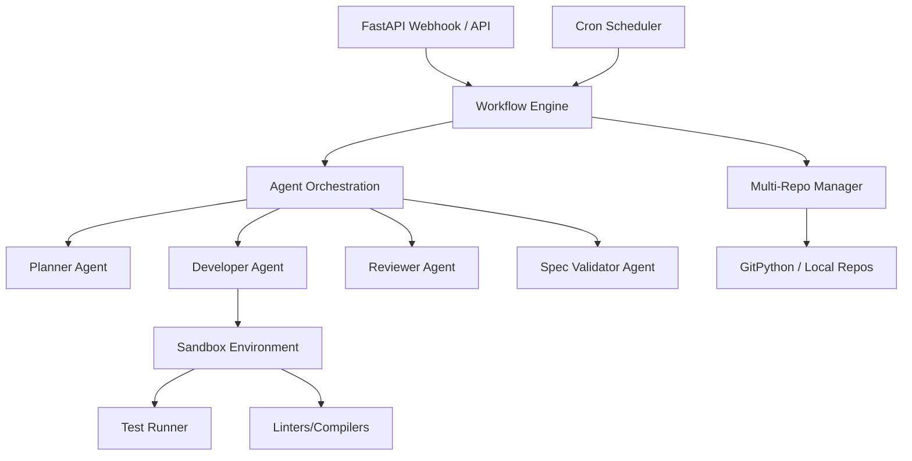
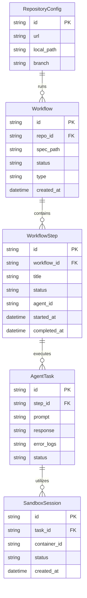

# Spécification Technique - Plateforme d'Orchestration Multi-Agents Autonomes

Cette spécification technique définit l'architecture globale, les technologies retenues, la structure du code source, ainsi que les interfaces clés pour l'implémentation de la plateforme d'orchestration multi-agents autonomes, en stricte conformité avec le Document d'Exigences Produit (PRD) de `.\.zenflow\tasks\voici-la-decomposition-detaillee-cb0d\requirements.md`.

---

## 1. Contexte Technique et Dépendances

La plateforme sera développée en **Python 3.11+** pour bénéficier de l'écosystème robuste de bibliothèques d'agents IA, de traitement de données et d'outils de virtualisation.

### 1.1. Dépendances Principales
- **Framework Web et API**: `fastapi` & `uvicorn` pour exposer les API de contrôle et les points d'entrée des Webhooks.
- **Validation et Configuration**: `pydantic` (v2) pour la gestion typée des configurations et des schémas d'API.
- **Orchestration d'Agents / LLM**: `langchain-core` et connecteurs natifs (`openai`, `anthropic`, `google-generativeai`) pour la communication multi-modèles.
- **Base de Données et Persistance**: `sqlmodel` (combinant SQLAlchemy et Pydantic) avec `sqlite` pour enregistrer l'historique des exécutions, logs, et configurations.
- **Gestion Git et Multi-Dépôts**: `gitpython` pour cloner, créer des branches, appliquer des modifications et gérer les cycles Git à travers plusieurs dépôts.
- **Isolation / Sandbox**: `docker` (via le SDK Python `docker`) pour exécuter les builds, tests et scripts de vérification dans des environnements conteneurisés éphémères.
- **Planification temporelle (Triggers)**: `apscheduler` pour les déclencheurs de type Cron.

---

## 2. Approche d'Implémentation

Le projet étant une nouvelle application (greenfield), l'architecture repose sur des modèles de conception clairs et modulaires visant la robustesse, la testabilité et l'extensibilité.

### 2.1. Principes d'Architecture
- **Service-Repository Pattern**: Séparation stricte de la logique métier (workflows, agents) et de l'accès aux données.
- **Abstractions Sandbox**: Une interface unifiée pour l'exécution du code permettant d'utiliser un interpréteur local en cours de développement (`LocalSandbox`) ou des conteneurs isolés en production (`DockerSandbox`).
- **Agents Spécialisés et Sans État**: Chaque agent est conçu comme une unité fonctionnelle prenant des entrées structurées (fichiers de code, consignes, historique de discussion) et produisant un résultat structuré via des outils d'appel (Function Calling).

### 2.2. Diagramme d'Architecture de la Plateforme



---

## 3. Structure du Code Source

L'ensemble des sources sera logé dans le répertoire `.\src` :

- **`.\src\core\config.py`**: Paramètres globaux et clés d'API (OpenAI, Anthropic, Gemini, etc.) via Pydantic Settings.
- **`.\src\core\database.py`**: Configuration du moteur de base de données et sessions d'écriture.
- **`.\src\models\db_models.py`**: Définition des schémas SQLModel pour les tables de base de données.
- **`.\src\sandbox\base.py`**: Classe de base abstraite `BaseSandbox` définissant l'interface d'exécution de commandes.
- **`.\src\sandbox\docker_sandbox.py`**: Implémentation `DockerSandbox` gérant le cycle de vie des conteneurs d'exécution.
- **`.\src\sandbox\local_sandbox.py`**: Implémentation `LocalSandbox` pour l'exécution directe locale via `subprocess` (utile pour les environnements de test).
- **`.\src\agents\base.py`**: Classe abstraite d'agent IA `BaseAgent` gérant l'intégration LLM.
- **`.\src\agents\planner.py`**: Agent chargé de la planification et de la génération de plans d'implémentation.
- **`.\src\agents\developer.py`**: Agent chargé de générer et de modifier le code source.
- **`.\src\agents\reviewer.py`**: Agent chargé d'analyser le code sur les aspects qualité et sécurité.
- **`.\src\agents\spec_validator.py`**: Agent validateur s'assurant de la conformité du code vis-à-vis du PRD.
- **`.\src\repository\manager.py`**: Service de gestion multi-dépôts clonant et manipulant l'arborescence des dépôts Git.
- **`.\src\workflows\engine.py`**: Moteur d'orchestration orchestrant les étapes d'un workflow (Spec-Driven, Bug-Fix, Refactor).
- **`.\src\api\router.py`**: Routes API FastAPI (Webhook, lancement manuel, statut des tâches).
- **`.\src\scheduler\cron.py`**: Gestionnaire des tâches planifiées.
- **`.\src\main.py`**: Point d'entrée de l'application FastAPI.

Les fichiers de configuration globaux du projet :
- **`.\requirements.txt`**: Liste des dépendances épinglées.
- **`.\pyproject.toml`**: Configuration des outils d'analyse statique et de test.

---

## 4. Modèle de Données, API et Interfaces

### 4.1. Modèle Physique de Données (Base de Données)



### 4.2. Spécification des API REST (FastAPI)

#### Triggers & Workflows
- **`POST /api/v1/webhooks/github`**
  - **Description**: Point d'entrée pour les webhooks GitHub (Pull Request, Push).
  - **Payload**: Données standard de webhook GitHub.
  - **Response**: `202 Accepted` avec l'ID du workflow initié.
- **`POST /api/v1/workflows/trigger`**
  - **Description**: Lancement manuel d'un workflow.
  - **Payload**: `{ "repository_id": "uuid", "workflow_type": "full_sdd", "spec_file_path": ".\specs\feature.md" }`
  - **Response**: `201 Created` avec les détails du workflow.
- **`GET /api/v1/workflows/{workflow_id}`**
  - **Description**: Récupération du statut d'avancement d'un workflow en temps réel.
  - **Response**: `{ "id": "uuid", "status": "inprogress", "steps": [...] }`

#### Configuration des Dépôts
- **`POST /api/v1/repositories`**
  - **Description**: Enregistrement d'un nouveau dépôt Git cible.
  - **Payload**: `{ "url": "https://github.com/...", "branch": "main", "local_path": ".\repos\repo-1" }`
- **`GET /api/v1/repositories`**
  - **Description**: Récupération de la liste des dépôts Git configurés.

### 4.3. Interfaces Programmatiques Clés

#### `BaseSandbox` (`.\src\sandbox\base.py`)
```python
from abc import ABC, abstractmethod
from typing import Dict, Any

class BaseSandbox(ABC):
    @abstractmethod
    def start(self) -> None:
        """Démarre la sandbox (ex: lance le conteneur Docker)."""
        pass

    @abstractmethod
    def execute(self, command: str, timeout: int = 300) -> Dict[str, Any]:
        """Exécute une commande shell et retourne (stdout, stderr, exit_code)."""
        pass

    @abstractmethod
    def stop(self) -> None:
        """Arrête et nettoie la sandbox (ex: supprime le conteneur)."""
        pass
```

#### `BaseAgent` (`.\src\agents\base.py`)
```python
from abc import ABC, abstractmethod
from typing import Dict, Any

class BaseAgent(ABC):
    def __init__(self, model_name: str, temperature: float = 0.0):
        self.model_name = model_name
        self.temperature = temperature

    @abstractmethod
    def run(self, input_data: Dict[str, Any]) -> Dict[str, Any]:
        """Exécute l'agent avec les données d'entrée fournies et retourne la réponse."""
        pass
```

---

## 5. Approche de Vérification

Pour garantir la qualité et la conformité, nous établissons des scripts de vérification robustes.

### 5.1. Outils d'Analyse de Code et de Qualité
- **Tests Unitaires**: Écrits en `pytest`. Les tests couvriront le parsing de spécifications, la communication avec les API de LLM, les opérations Git, et le cycle de vie de la sandbox.
- **Formateur et Linter**: Utilisation de `ruff` pour le formatage et l'analyse statique afin d'assurer l'homogénéité du code.
- **Vérification de Types**: `mypy` pour s'assurer que toutes les signatures d'interfaces respectent le typage Python statique.

### 5.2. Commandes de Vérification Locales
- Formatage du code : `ruff format .`
- Analyse de Lint : `ruff check .`
- Vérification de typage : `mypy src/`
- Exécution de la suite de tests : `pytest`
