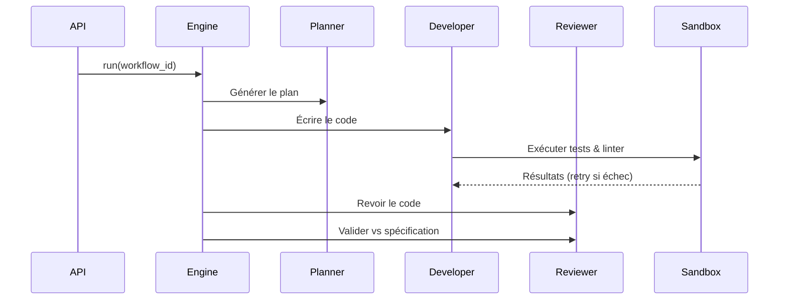

## Vue d'ensemble du projet

Il s'agit d'une **plateforme d'orchestration multi-agents autonomes** qui permet de piloter des agents IA pour automatiser des workflows de développement (rédaction de code, correction de bugs, refactoring) à partir de spécifications.

---

## 1. Installation

```bash
pip install -r requirements.txt
```

---

## 2. Configuration

Créez un fichier `.env` à la racine du projet :

```env
# Base de données (SQLite par défaut)
DATABASE_URL=sqlite:///./platform.db

# Clés LLM (au moins une est nécessaire)
OPENAI_API_KEY=sk-...
ANTHROPIC_API_KEY=sk-ant-...
GEMINI_API_KEY=...

# Optionnel : sécurisez vos webhooks GitHub
GITHUB_WEBHOOK_SECRET=votre-secret-ici
```

---

## 3. Lancer le serveur

```bash
uvicorn src.main:app --reload
```

L'API est accessible sur `http://localhost:8000`.

- **Documentation interactive** : `http://localhost:8000/docs`
- **Health check** : `http://localhost:8000/health`

---

## 4. Utiliser l'API

### Enregistrer un dépôt Git cible

```bash
curl -X POST http://localhost:8000/api/v1/repositories \
  -H "Content-Type: application/json" \
  -d '{
    "url": "https://github.com/votre-org/votre-repo.git",
    "branch": "main",
    "local_path": "./repos/votre-repo"
  }'
```

Réponse : `{ "id": "uuid-du-repo", ... }`

---

### Déclencher un workflow manuellement

Trois types de workflows sont disponibles :

| Type | Description |
|---|---|
| `full_sdd` | Cycle complet : planification → développement → revue croisée |
| `fix_bug` | Correction de bug : développement → revue |
| `refactor` | Refactoring : planification → refactoring → revue |

```bash
curl -X POST http://localhost:8000/api/v1/workflows/trigger \
  -H "Content-Type: application/json" \
  -d '{
    "repository_id": "uuid-du-repo",
    "workflow_type": "full_sdd",
    "spec_file_path": "./specs/ma-feature.md"
  }'
```

Le `spec_file_path` pointe vers un fichier Markdown décrivant la fonctionnalité à implémenter.

---

### Suivre l'avancement d'un workflow

```bash
curl http://localhost:8000/api/v1/workflows/{workflow_id}
```

Réponse :
```json
{
  "id": "uuid",
  "status": "running",
  "type": "full_sdd",
  "steps": [
    { "title": "Planning", "status": "completed", "agent_id": "planner" },
    { "title": "Development", "status": "running", "agent_id": "developer" }
  ]
}
```

---

### Configurer un webhook GitHub

Dans les paramètres de votre dépôt GitHub :

- **Payload URL** : `http://votre-serveur/api/v1/webhooks/github`
- **Content type** : `application/json`
- **Secret** : la valeur de `GITHUB_WEBHOOK_SECRET`
- **Événements** : `push` et `pull_request`

Un `push` déclenche automatiquement un workflow `fix_bug`, une `pull_request` déclenche un `full_sdd`.

---

## 5. Planifier des tâches automatiques (Cron)

Le scheduler est intégré et démarre avec l'application. Pour ajouter des tâches planifiées programmatiquement dans votre code :

```python
from src.scheduler.cron import scheduler

def triage_quotidien():
    # logique de triage des bugs
    pass

# Expression cron : minute heure jour mois jour_semaine
scheduler.add_job(triage_quotidien, "0 9 * * 1-5", job_id="triage")
```

---

## 6. Architecture des agents

Quand un workflow s'exécute, voici ce qui se passe en coulisses :



---

## 7. Lancer les tests

```bash
pytest
```

Pour un fichier spécifique :

```bash
pytest tests/test_api.py -v
```
